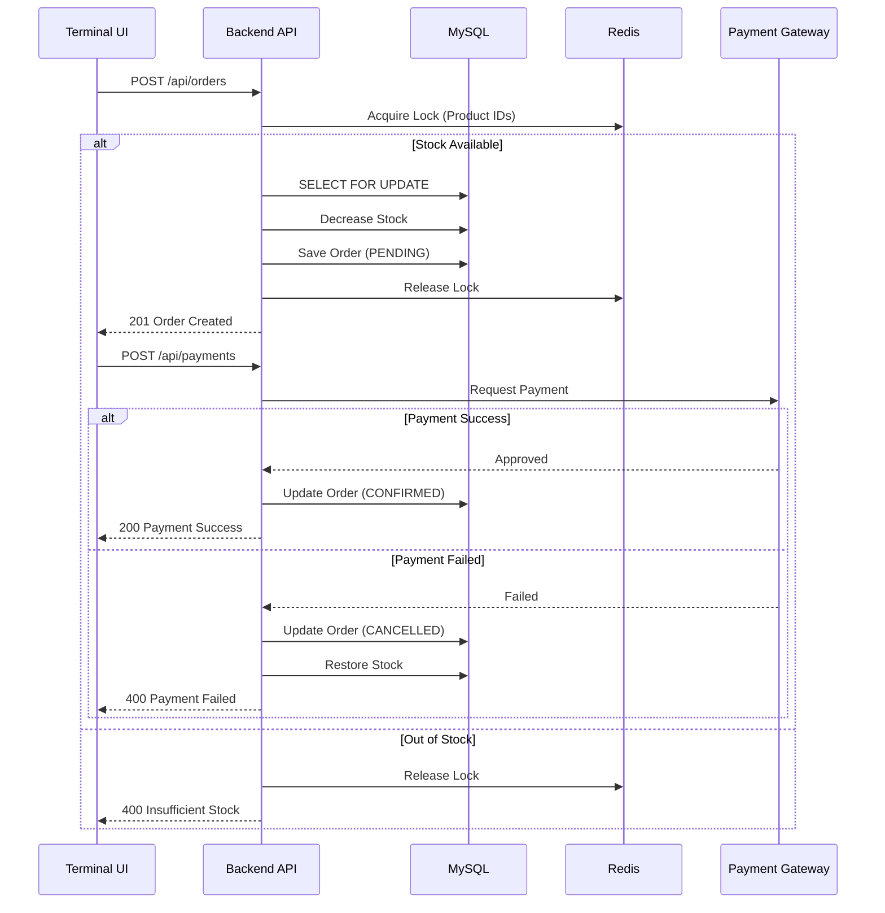
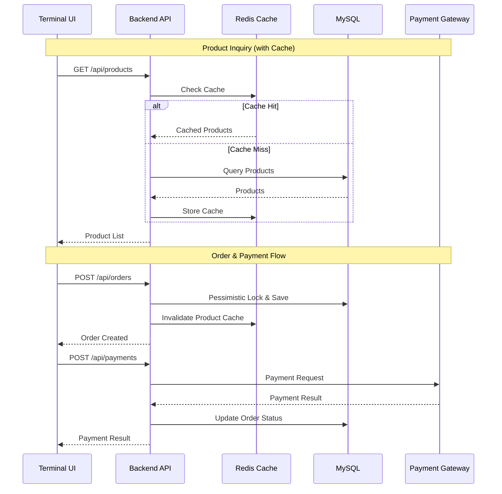
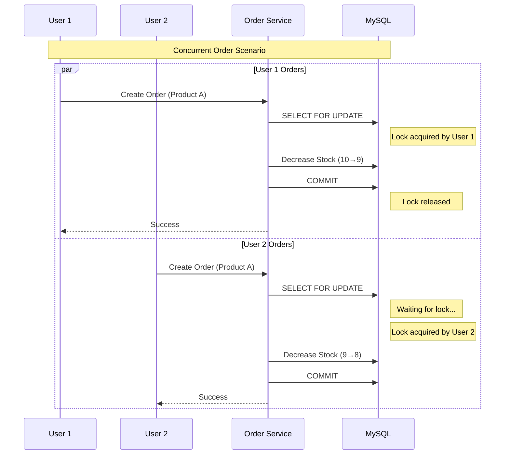

# Kiosk Management System (Backend API)
> Java 21 / Spring Boot 3 기반의 주문 처리 중심 키오스크 백엔드 시스템


키오스크 주문 흐름을 **MVP → MSA → Voice Kiosk**로 단계 확장하는 개인 프로젝트입니다.  
Phase 1에서는 **상품/주문 핵심 도메인 + 캐싱 + 동시성 제어**에 집중하고,  
Phase 2에서 Store/Inventory 도입과 함께 MSA 전환, Phase 3에서 Spring AI + TTS 기반 음성 키오스크로 확장합니다.

> 현재 레포는 **Phase 1 (Backend API)** 중심입니다.

---

## Demo / Links
- Swagger UI: `http://localhost:8080/swagger-ui.html`
- Local API: `http://localhost:8080`
- Adminer (DB): `http://localhost:9090`
- RedisInsight (Redis Stack): `http://localhost:8001`

---

## Phase Roadmap

### ✅ Phase 1: Monolithic MVP
- 핵심 주문 도메인
- 캐싱 전략
- 동시성 제어
- AWS 배포

### ⏳ Phase 2: MSA 전환
- Store / Inventory 서비스 분리
- 서비스 간 통신 전략 (REST or Messaging)
- 데이터 일관성 전략 정의
- Android Shell 전환

### ⏳ Phase 3: Voice Extension
- Spring AI 도입
- TTS/STT 연동
- 음성 주문 Flow 설계


---

## Key Features (Phase 1)
- **상품 관리**: CRUD, Redis 기반 캐싱
- **주문 처리**: 재고/동시성 고려, 락 기반 정합성 확보
- **터미널 관리**: 키오스크 단말 상태/식별 관리
- **운영 편의**: Swagger 문서, P6Spy 로깅, Testcontainers 기반 동시성 테스트

---

## Tech Stack
### Backend
- Java **21**
- Spring Boot **3.5.10**
- Spring Data JPA / Validation / WebSocket
- Redis (Cache) + Spring Cache
- MySQL
- SpringDoc Swagger UI
- P6Spy (SQL 로깅)

### Test
- Spring Boot Test
- Testcontainers (MySQL)
- H2 (테스트 런타임)

### Infra (Local)
- Docker Compose (MySQL / Redis Stack / Adminer)

## Architecture Notes
- DDD 기반 패키지 구조 지향
- Layered Architecture (Controller → Service → Domain → Repository)
- 동시성 제어는 Pessimistic Lock 기반
- 데드락은 정렬 기반 규칙으로 회피

## Quick Start (Local)
### 1) Docker (MySQL / Redis / Adminer)
```bash
docker compose up -d
```
```bash
./gradlew bootRun
```
## Troubleshooting Log
### 2026-02-19 - Redis record 역직렬화 문제
- 현상: record 타입 캐시 복원 시 타입 불일치
- 원인: record 특성상 기본 생성자 부재 → LinkedHashMap 매핑
- 해결: TypeResolverBuilder 커스텀 적용하여 타입 정보 유지
- 배운 점: 캐시 직렬화 전략은 초기 설계 단계에서 명확히 정의해야 함


## API Docs
- Swagger UI: http://localhost:8080/swagger-ui.html
- Error Codes: docs/error-codes.md (추가/정리 예정)
- Troubleshooting Log

## Repo Conventions (협업 시뮬레이션)
- Commit: Conventional Commits 권장
- feat:, fix:, refactor:, docs:, test:, chore:
- Branch: feature/* → PR → main merge
- GitHub: Issues / Milestones / Project Board로 Phase 단위 트래킹
- CI: (예정) Front 도입 시점부터 GitHub Actions로 test/lint 자동화

## Next
- Phase 1: Front(React JSX + Zustand) 연결 + AWS 배포
- Phase 2: Store/Inventory + MSA 전환 (서비스 바운더리/데이터 일관성 전략 문서화)
- Phase 3: Voice Kiosk (Spring AI + TTS/STT)

## Order / Payment Flow



## Cache Flow


## Concurrent Order Flow
